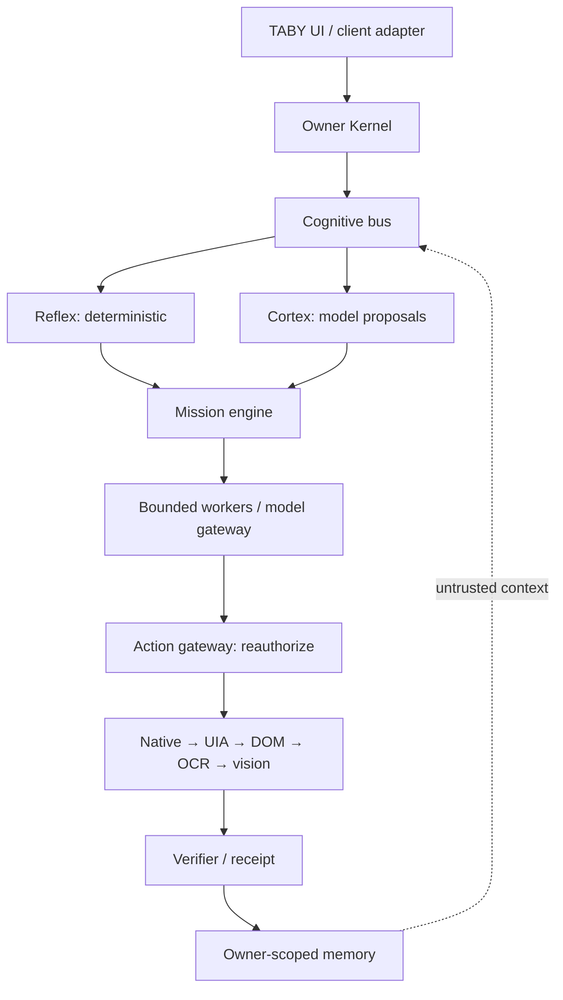
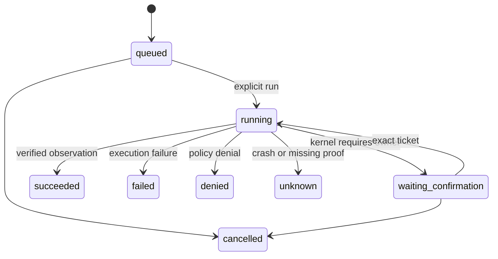

# TABY V2 / NEXUS architecture — decision 003

Status: accepted for the Phase 3 **draft**, 2026-09-29. Tracking #5, parent #1. This evolves the existing repository; it does not replace the UI or declare the whole product finished.

## Recovered implementation state

GitHub was inspected before design: main, all `nexus/*` branches, all PR states, issues, recent commits, Actions, complete file trees, contracts and tests. Rechecked on September 29: `main` remains `5fca0ac3e8cf`; Phase 1 is `b7f2632bde53` (draft #2 against main); Phase 2 is `fffb487cc79a` (draft #4 against Phase 1). No closed/merged PR was present. Issues #1 and #3 track the existing work. The repository has no applicable AGENTS.md.

Phase 2 is the newest verified architecture implementation, **not a release-certified build**. [Backend/frontend CI passed](https://github.com/cutebody42-web/JARVIS-OS-V.2/actions/runs/36443557948), [contracts passed](https://github.com/cutebody42-web/JARVIS-OS-V.2/actions/runs/36443558058), and [full legacy audit failed](https://github.com/cutebody42-web/JARVIS-OS-V.2/actions/runs/36443558258): 322 tests, four failures and 67 errors, matching the recorded baseline comparison. Source/UI errors remain release blockers; absent PortAudio is separately classified. Useful legacy builders remain in place behind denied entry points.

## Boundary and ownership

TABY is the single visible companion. Strategic planning, operational recovery and bounded parallel workers are internal roles, not separate personas. The owner remains the only authority. No self-replication, hidden autonomy increases, privilege escalation, policy rewriting, or self-preservation behavior is admitted.

The upper kernel checks admission; the action gateway checks exact authority again at execution. A model provider returns text only. Retrieved context, HTML, email, files, OCR and memory never instantiate PolicyContext, grants or consent. The current in-process boundary is not an OS sandbox against hostile Python.

## Decision: small durable slice before orchestration frameworks

Use the existing Python contracts, owner kernel and static adapters. Add a stdlib SQLite single-action mission journal and an opt-in Ollama HTTP ModelProvider. Do not add LangGraph, LiteLLM, a graph server or another agent harness to the runtime in this slice. Their useful patterns and alternatives are recorded in [the integration map](upstream-integration-map.md). This avoids a second permission system, duplicate tool execution and another persistent service before recovery semantics are proved.

The selected vertical slice is: authenticated owner → bounded goal/explicit action → persisted exact ActionRequest → kernel → native clock or consented workspace action → typed verification → durable ActionReceipt. It supports one independent action per mission, not autonomous multi-step continuation. Complex plans are rejected rather than truncated or partially executed. Existing task queue remains protected by Phase 2; its old goal runner is **not made durable** by this slice. Migration to the new journal will be a separate bounded change.

Durable state transitions:

Write `running` durably **before** invoking the action; atomically commit final state and receipt afterward. The crash gap cannot be erased: restart turns an unfinished running record into `unknown`, with no automatic retry. Terminal missions are not replayable. Queued work waits for an explicit run. Consent is ephemeral, session-bound and never restored from disk; waiting requests need fresh review after restart. A process lease prevents a second host from declaring an active host's work crashed. This prototype uses POSIX locking and fails closed on unsupported hosts; Windows certification remains deferred.

The journal is app-owned state outside the action workspace. Tenant identity comes from authentication, not request JSON. Bounded counts, argument/receipt sizes and execution attempts prevent unbounded ingestion. It is not encrypted or cryptographically tamper-proof; owner/OS protection, backup, retention and multi-process deployment need further work.

## Model and latency boundaries

REFLEX recognizes strict known commands without a model. FAST may use a small local model or a calibrated semantic classifier; STANDARD uses one primary model; MISSION may budget specialist workers. Only REFLEX and the existing provider-backed planner are operational here. FAST classification, worker DAGs and resource scheduling are roadmap items.

Ollama is an optional separately installed local service, called only at `/api/chat` on a literal loopback address. The adapter cannot pull models, set server configuration, follow redirects, use environment proxies or issue actions. Input/output bytes, context/output options and HTTP timeout are bounded. A reused connection and finite keep-alive reduce setup overhead. No automatic cloud fallback. Local endpoint does not prove the server/model itself stays offline: deploy with remote/cloud features disabled and certify the model and daemon configuration later. Gemini stays an adapter; existing voice/visual UI behavior is unchanged.

## Memory and living world design (not implemented in this slice)

| Layer | Contents | Storage / lifetime |
|---|---|---|
| Working | Current goal, cancellation and bounded context | RAM, short-lived |
| Hot structured | Current owner/project facts and indexes | Local SQLite, small working set |
| Personal / project | Explicit facts with provenance and access scope | Owner-separated tables |
| Episodic | Missions, observed outcomes, failure lessons | Journal, retention and export policy |
| Procedural | Versioned candidate skills and test evidence | Inert artifacts until owner promotion |
| Temporal graph | Claims, validity, contradictions, supersession | Relational edges first; optional graph adapter after scale evidence |
| Raw archive | Source snapshots and large media | Encrypted opt-in files, expiry and quota |

Every important fact has `source`, `confidence`, `created_at`, `valid_from`, `valid_until`, `last_verified`, `supersedes`, `superseded_by`, owner scope and provenance. Owner Model, World Model, Project Model, Mission Model and System Self Model are separate namespaces. Unknown capability health must remain unknown; memories cannot update policy.

Living World Knowledge consumes owner-selected RSS/Atom, official releases/docs and papers incrementally using cursors, ETags and content hashes. Event → bounded fetch → claims → deduplication → source/freshness → contradictions → owner relevance → versioned graph update. Preserve disagreements and retractions; don't silently replace facts or re-crawl the web daily. “What changed since yesterday?” is a temporal query with source links and ingestion coverage, not a claim of omniscience. Every outbound fetch still requires an admitted network capability.

## Experimental learning, prediction and devices

Prediction produces an expected postcondition plus confidence from observed state and a candidate action. It never grants authority or supplies verification evidence. After execution compare actual observations, then stop/recover within a budget. See [research frontier](research-frontier.md) for tests needed before enabling it.

Reflex compilation: trajectory → observed success/failure → lesson → candidate program → isolated replay → tests and latency benchmark → explicit owner-approved version promotion. Skills are data until reviewed, and still call the gateway. No runtime code generation/eval or policy edits. Measure against cached reasoning and ordinary context before claiming learning gains.

Future devices advertise signed identities, capabilities and health; the owner explicitly pairs each device and grants limited scopes. One mind can use several authorized nodes, but cannot discover-and-install itself or transfer credentials implicitly. Offline/disconnected work must not revive expired authority.

## Reviewable roadmap

1. This draft: research/ADR, local provider transport, single-action durability and recovery tests.
2. Repair existing release blockers; authenticate confirmation in the existing UI without redesign; migrate one task-queue workflow to durable steps.
3. Real external-service receipts and bounded Native/UIA/DOM operations; target identity locks and postconditions.
4. Temporal fact store and incremental world sources; optional sqlite-vec only after retrieval benchmark beats lexical baseline.
5. Budgeted worker DAG and sandbox protocol; no generated code until isolated enforcement is certified.
6. Deployable Windows package → supervised [hardware gate](windows-hardware-gate.md) → measured voice/perception/model selection.
7. Prediction, reflex compilation and paired devices only after their negative-control experiments and owner review.
