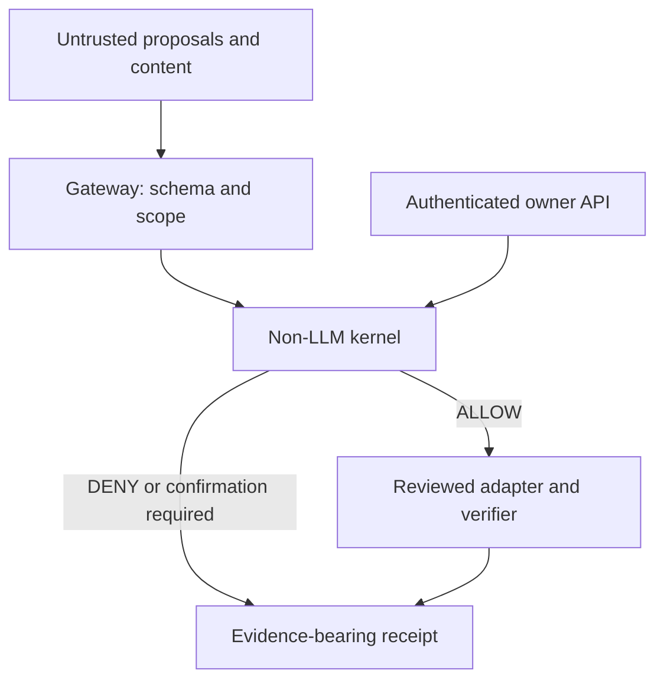

# Sovereign Owner Kernel threat model — Phase 2

The kernel protects the application action boundary against hostile model proposals and untrusted text. It is not an operating-system sandbox against malicious Python running with the application's privileges.

## Assets and trust

Protect owner authority, policy/source code, secrets, scoped files, outbound communication and honest completion reporting. Trusted code consists of host bootstrap/authentication, the immutable capability definitions, kernel, gateway and reviewed adapter/verifier implementations. Models, webpage/email/file text, retrieved memory, task goals and model-supplied tool arguments are untrusted data.

Hosted identity comes from existing authenticated API users. Each Live connection creates a fresh owner runtime and random session identifier; reconnect/shutdown clears authority. Native bootstrap's `local-owner` is a host composition convention, not biometric or Windows identity proof. Models never receive an OwnerControl object or an approval endpoint as a tool.

## Threats and controls

| Threat | Control | Evidence / limit |
|---|---|---|
| Model invents a safe-sounding mutation | Exact static registry; all unknown capabilities/sub-actions denied | Unknown-mutation and declaration-coverage tests; no name-based risk classifier |
| Webpage/email/file/memory claims to be owner or system policy | Content is never parsed as a grant; code policy has no model-edit API | Source-specific adversarial proposals, immutable registry/context tests and verified-file injection test |
| Prompt asks for Python, shell, admin, replication, arbitrary browser script | Composite code/browser/system capabilities forbidden, regardless of alleged consent | Executor/Live/queue tests assert no adapter invocation; workers cannot spawn workers |
| “Approve” tool call uses a changed or global draft | Sending requires full normalized recipients/subject/body snapshot; old pending-draft helpers are not read | Exact Gmail-payload and bare-approve tests; DOM/message sending remains denied |
| Ticket substitution, replay or changed arguments | Random server-side ticket, bound owner/session/request/capability/digest/version; atomic single use before invocation | Changed to/cc/bcc/subject/body, request/capability, expiry/revoke/replay and concurrent-consumption tests |
| Approval lifetime widened by model | No model ticket/context/grant argument; authenticated HTTP body rejects extra fields; maximum 300 seconds and pending-request deadline | API tests and monotonic-clock boundary tests |
| Consent expires/revokes while work waits | Worker rechecks at invocation under resource lock | Deferred-worker revoke/expiry tests; in-flight work cannot be undone retroactively |
| Workspace traversal, symlink swap, hardlinked reads | Relative inert text paths; `openat`/`O_NOFOLLOW` on every directory component, exclusive new-file creation, bounded regular-file reads, source-tree mutation denied | Real temporary-file tests; Windows reparse-point support is deliberately unavailable |
| Exfiltration through a search query | Web/weather egress requires exact owner approval too | Egress tests; arbitrary URLs/HTTP clients are not model tools |
| Cross-user tasks or credentials | Owner runtime captured at submission; execution restores that tenant; task lookup/cancel owner-scoped | Hosted tenant/owner API and queue isolation tests; no host Gemini-key fallback for a hosted user |
| Arbitrary specialized runner bypasses policy | Existing runner entry points are mapped to a forbidden capability; callable and completion/cancel callbacks never invoked | Runner and legacy composite tests |
| Model/adapter says “Done” without proof | Structured result; success requires trusted verifier evidence; Gmail/search/memory strings remain UNVERIFIED | Phase 1 regressions plus v2 receipt/adapter tests |
| QA flags grant authority | QA is an additional restrictive gate only | Even a real owner-approved email is blocked in QA mode |

## Consent semantics

The gateway validates bounded strict JSON, normalizes only documented fields, snapshots the resulting JSON and computes SHA-256 for equality binding. Email body whitespace is preserved. Approval records reference the stored snapshot, not a new payload. The owner submits the displayed digest and current session ID through the authenticated API. Execution accepts only the request ID and ticket ID, then revalidates policy/scope. An adapter failure still consumes its ticket; retry needs a fresh explicit request and approval.

Expiry uses a monotonic clock; UTC/wall-clock fields are informational. Consent and pending requests are memory-only, with bounded pending requests, short lifetimes and revocation on shutdown. Tickets cannot survive restart. The digest is **not** a signature, an authenticated log chain or cryptographic tamper-proofing. Receipts are ordinary application records and can contain sensitive arguments; the host must protect them. The in-memory receipt history is capped at 256 per runtime. Durable encrypted auditing and multi-process consent coordination are deferred.

## Explicit residual risks

An owner can approve harmful data after reading a malicious suggestion; this phase does not solve social engineering or authenticate human presence. Existing JWT/secret-store and provider implementations remain trusted dependencies. Owner API compromise, hostile extensions, monkeypatching, direct low-level helper calls, `__wrapped__` introspection or arbitrary same-process Python defeat an application-only boundary. Such code must never be offered as a model execution surface.

Raw builders, OS helpers and standalone developer APIs remain in the repository for unit testing and later adapter migration; only their audited exposed model entry points are guarded. General chat/provider prompt egress is governed by existing configured-model use, not a per-token action ticket. Selecting/enforcing local-only models is a later gateway phase.

Free-form model chat/audio is not a verifier. The Live prompt explains receipt semantics, but that prompt is not an enforcement boundary or proof that generated speech can never be misleading. Only structured gateway/executor/queue results establish completion. Rendering these receipts in a future confirmation UI remains separate work; no visual UI was changed here.

No verified external delivery, secure Windows filesystem adapter, biometric identity, desktop/UAC isolation, camera/microphone certification, or laptop performance claim is made. A verified file write means bytes were read back on its open handle; it does not guarantee another process will never change the file later. Partial new files may remain if an I/O failure interrupts writing. General plan continuation after approval is deferred: execute approves one exact pending action; it never marks an entire queued plan complete.
